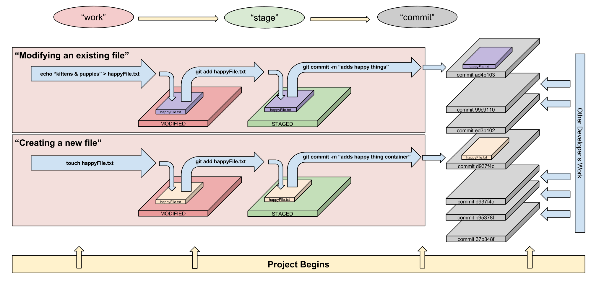

## 1.2 Hello, World

#### Data Types, Variables, and Arrays

##### Objectives

- Describe the concept of a "data type" and how it relates to variables
- Describe use cases of different "data types"
- Declare, assign to, and manipulate data stored in a variable
- Explore and use a programming or markup language's standard library and built-in functions (iterators, datatype/array methods)
- Iterate over and and manipulate values in an array
- Describe how arrays are used to store data

#### Lab: Introduction to Git & Github

- 
