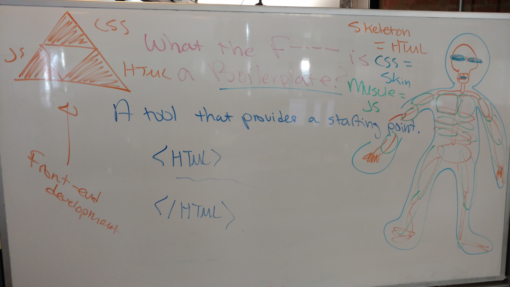
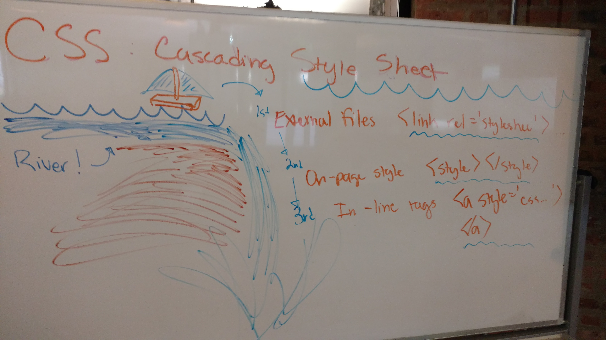

## Creating Beautiful HTML & CSS

#### HTML & CSS
- Re-introduction to HTML and CSS
- Anatomy of a website: Skeleton, Muscle, Clothes
- What is the DOM? The `document` object?
- What is CSS? What is a selector?
- How to create and style a page
- Implement semantic HTML5 tags

#### CSS in Depth

- Connect local repositories to remote repositories
- Download changes from a remote git repository to a local computer
- Style all elements of a particular tag (e.g. all buttons) on a web page
- Apply a set of styles to a set of arbitrary elements
- Apply a set of styles to a specific element
- Apply a set of styles to children of a specific class or tag
- Load styles from an external .css file
- Use color-based styles to style a containment element (div)

##### Resources

* Basic Boilerplate Example: [https://github.com/code-for-coffee/html_css_js_boilerplate](https://github.com/code-for-coffee/html_css_js_boilerplate)

**DOM as Skeleton, JS as Muscle, CSS as Skin**

**CSS: Waterfall**

