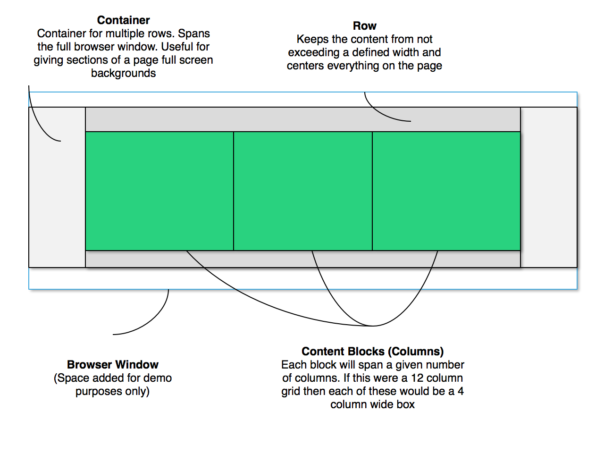
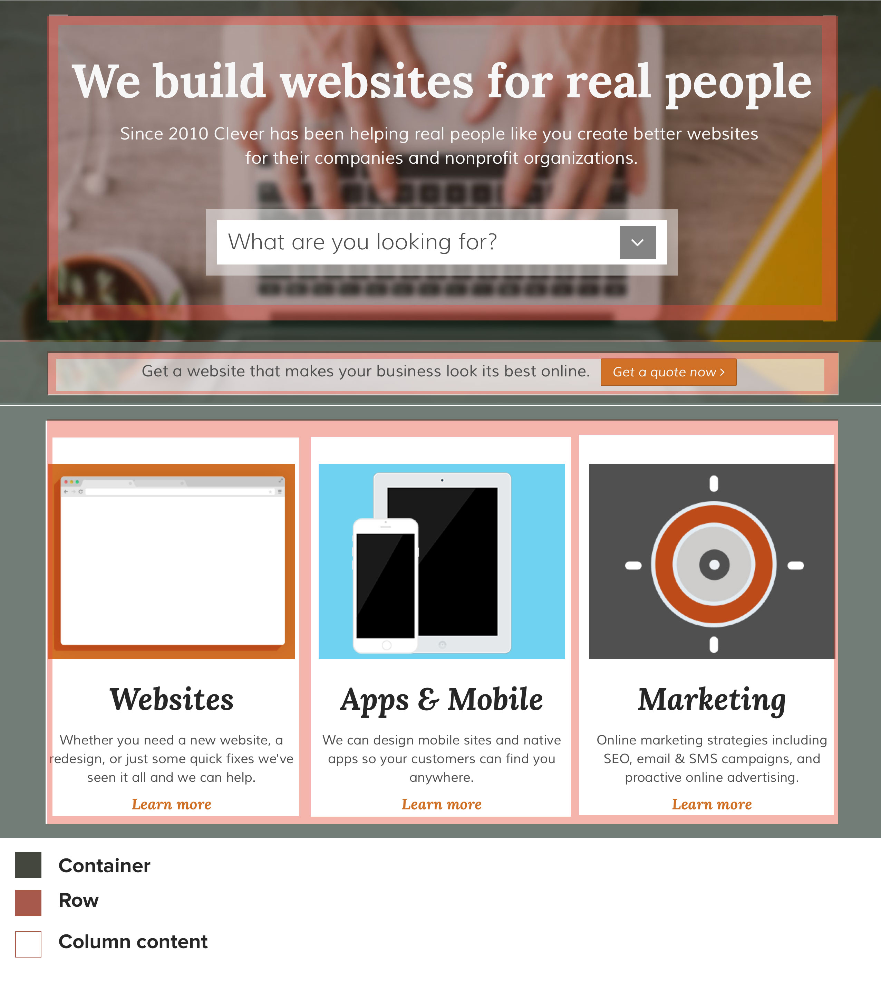

# Flexbox and CSS Grid Systems

## Containers, rows, and columns

Traditional CSS grids are based on the idea of containers, rows, and columns.

A container is a full width element that is as wide as the browser window.

A row sits within a container and is centered within it. A row will have a maximum and minimum width.

Most grids utilize 12 columns. The idea is that each item within a row takes up a number of column widths. All of the column elements within a row should add up to 12 in a 12 column grid.

### Grid Example

```css
.container {
  width: 100%;
}

.row {
  width: 1140px;
  margin: auto;
}

.col-1 {
  width: 95px;
  float: left;
  position: relative;
  padding: 10px;
  box-sizing: border-box;
}

/* and more grid classes here */
```


<small>Shown Above: Grid diagram (extra padding added between container, row, and column blocks for clarity)</small>


<small>Shown Above: Example of a grid system being used on an actual web page</small>

## Flexbox

Flexbox grids are easier. The idea is that you have a container and items. Each item gets automatically positioned within the container without the need for floats or percentage widths for responsive sites.

__[See this better guide to Flexbox than any of us could write for more](https://css-tricks.com/snippets/css/a-guide-to-flexbox/)__
