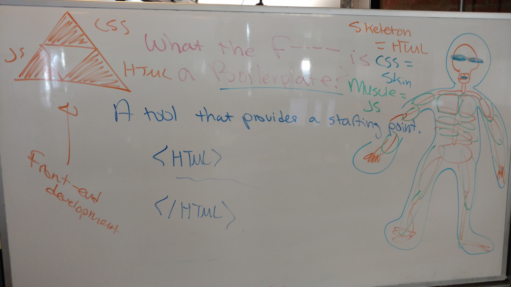
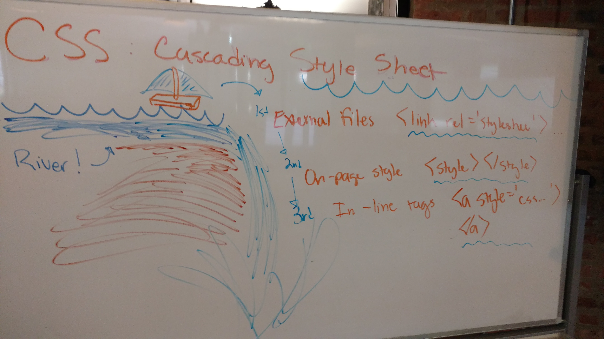
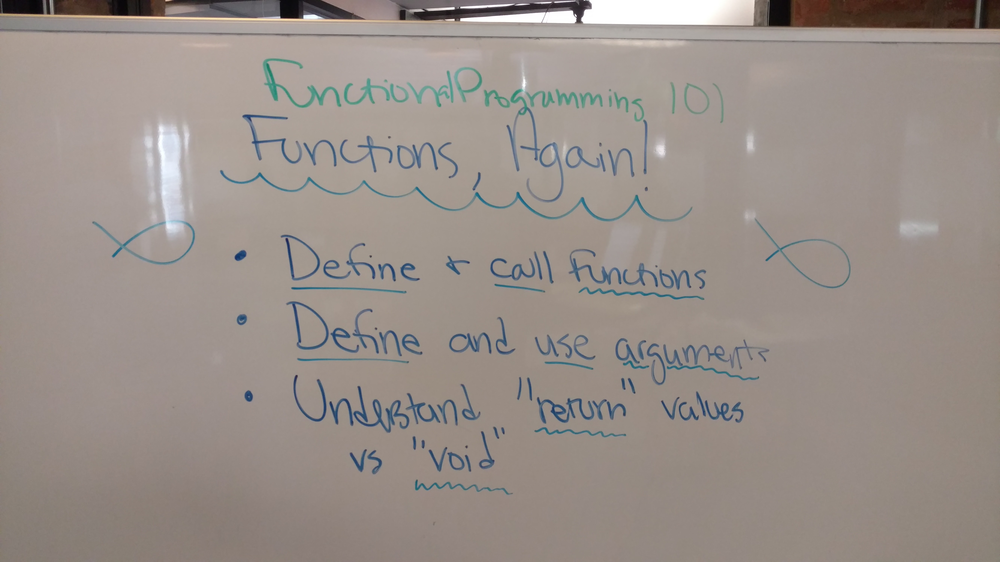

## Functions, Objects, & Recap

Today we've taken time to take another look at the concepts we've been learning.

#### HTML + CSS + JS Boilerplate Lab

* James' example: [https://github.com/code-for-coffee/html_css_js_boilerplate](https://github.com/code-for-coffee/html_css_js_boilerplate)

**DOM as Skeleton, JS as Muscle, CSS as Skin**

**CSS: Waterfall**

#### Functions

